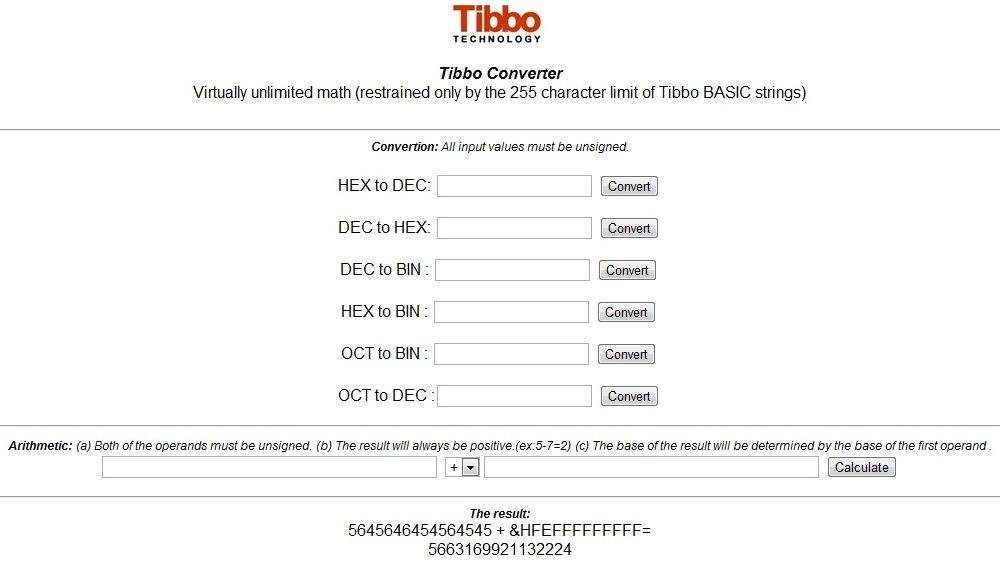

# Virtually Unlimited Math (restrained only by 254 characters)

## About the Application

This library's mission in life is to help you convert very large numbers between different bases, as well as perform simple calculations on very large numbers. This can be very handy for hashing algorithms, encryption, and all sorts of other tasks that require number conversion.

We call it a library because you can easily integrate it into your projects. But since you might want to play with it without putting it into an existing project, we went ahead and put in a Web interface so you can just treat it as a full-fledged Tibbo BASIC demo app. Here's what it looks like in a browser:

The actual data type handled by the library is **string**. It receives a string, and returns a string. When performing calculations, the result is always given in the base of the first operand. So if you feed it with a Hex number first and tell it to add a decimal number, the result will be given in Hex. Here's how plain conversion works for different bases:

### Hex to Decimal

**Input:** A string containing a hex number, up to 211 digits in length. Its value must be lower than "DA3C0F568CC4F3E8C9E5D72D90A2741E1B081050F30E0C36A1E157ADF8F809A44AC6BCF927
620752F1B5C8C06411BBC60E1702724F1C3A380CEC7DC5F31FF9BC6B6E84EEA5046A44E0A3F
FFFFFFFFFFFFFFFFFFFFFFFFFFFFFFFFFFFFFFFFFFFFFFFFFFFFFFFFFFFFFF"

**Output:** A string containing a decimal number. Scientific notation is not supported, so if you feed in a huge number you'll receive a huge number (with lots of digits) back.

### Decimal to Hex

**Input:** A string containing a decimal number, up to 254 digits in length. No scientific notation — just plain digits.

**Output:** A string containing a hex number.

### Decimal to Binary

**Input:** A decimal string, up to 77 digits long, anywhere from zero to 28948022309329048855892746252171976963317496166410141009864396001978282409983.

**Output:** A string with lots of zeros and ones, representing the number you fed it with.

### Hex to Binary

**Input:** A string with up to 64 hexadecimal digits, from 0 to 3FFFF....

**Output:** A string with lots of zeros and ones, representing the number you fed it with.

### Octal to Binary

**Input:** A string containing a number in octal base, from 0 to 377777.... (85 digits total).

**Output:** A string with lots of zeros and ones, representing the number you fed it with.

### Octal to Decimal

**Input:** A string with an octal number, up to 254 digits long.

**Output:** A string with a decimal number.

  